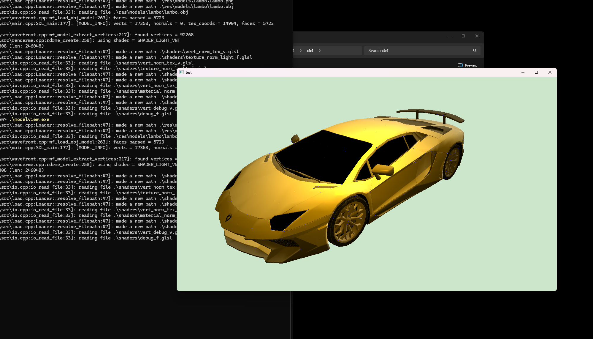

# ModelView

A simple 3D model viewer built with OpenGL.



## setup submodules

```bash
git submodule init && git submodule update --recursive
```

## Environment setup

**NOTE**: make sure `clang --version` is >= 3.5 if you want `compile_commands.json` generation, this is useful in case you're working with VSCode; LSP config comes free.

### Windows

I've been testing this on a Windows machine using Visual Studio 2022 Community Edition. Please ensure the following:

- Install a version of **C++ Build Tools** via the **Visual Studio Installer**.
- Ensure `MSBuild.exe` is listed in your Windows `Path` environment variable.
- Add the following directory to your `Path` environment variable to prevent crashes:
    ```
    C:\Program Files\Microsoft Visual Studio\2022\Community\VC\Tools\MSVC\14.42.34433\bin\Hostx64\x64
    ```
    This prevents the `modelview.exe` from crashing on startup due to missing `clang_rt.asan_dbg_dynamic-x86_64.dll` and `clang_rt.asan_dynamic-x86_64.dll`.

- **OpenGL** must be installed on your system:
    - Install **Mesa** using MSYS pacman:
        ```bash
        pacman -S mingw64/mingw-w64-x86_64-mesa
        ```
    - Alternatively, you can follow the [official Khronos guide](https://www.khronos.org/opengl/wiki/Platform_specifics:_Windows#Installing_Mesa3D_on_Windows), but using MSYS pacman is easier.

### Linux/MacOS

Both Linux and macOS share similar setup steps. Here's what you need to do:

- **Install OpenGL**:
   - **Linux**: Use your package manager to install the OpenGL libraries:
     ```bash
     sudo apt-get install libgl1-mesa-dev
     ```
     Or, if using **Arch Linux**:
     ```bash
     sudo pacman -S mesa
     ```

   - **macOS**: OpenGL should already be installed by default. If you need to ensure you have the latest version, you can use Homebrew:
     ```bash
     brew install mesa
     ```

## Compiling

Use the appropriate compile script for your platform. The script will generate a debug-compatible executable.

- **Linux/macOS**:
    ```bash
    ./compile.sh
    ```

- **Windows**:
    ```bash
    .\compile.bat
    ```

## Supported Formats

| File Format | Supported | Platform | Supported |
|-------------|-----------|----------|-----------|
| .obj        | Yes       | Linux    | Yes       |
| .gltf       | No        | macOS    | No        |
| .fbx        | No        | Win32    | No        |