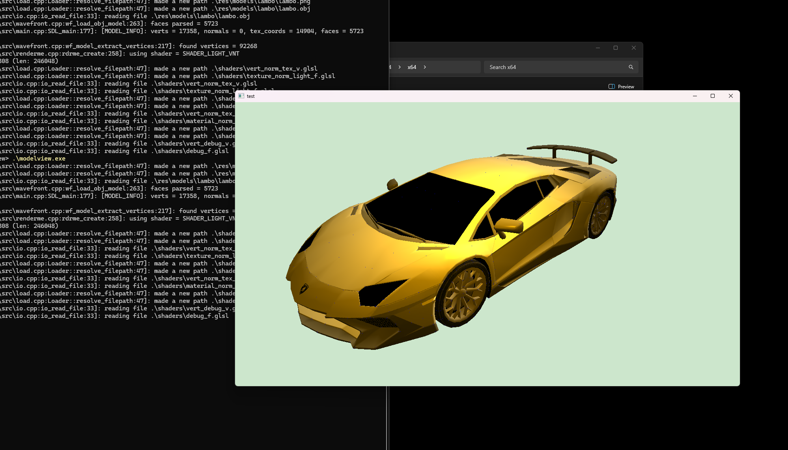

# ModelView

[](https://isocpp.org/)
[](https://cmake.org/)
[](#platform-setup)

A lightweight OpenGL model viewer written in C++ with SDL2 and GLAD.

## Features

- Real-time 3D rendering with OpenGL 3.2 core profile.
- OBJ mesh loading pipeline and material-based shading.
- Camera controls, debug visualization toggles, and dynamic lighting.
- Cross-platform CMake build (macOS, Linux, Windows).

## Screenshots

- Windows render sample (`assets/winlambo.png`):

  

- Additional screenshots for macOS/Linux and glTF scenes can be added under `assets/`.

## Quick Start

1. Clone and initialize submodules:

   ```bash
   git clone <your-fork-or-repo-url>
   cd modelview
   git submodule update --init --recursive
   ```

2. Run one command setup:

   ```bash
   ./setup.sh
   ```

This installs dependencies (where supported), configures CMake, and builds into `build/`.

## Platform Setup

### macOS (Apple Silicon + Intel)

Prerequisites:

- Xcode Command Line Tools
- Homebrew

Install manually (optional if using `./setup.sh`):

```bash
xcode-select --install
brew install cmake ninja pkg-config
```

Build:

```bash
cmake -S . -B build -DCMAKE_BUILD_TYPE=Release
cmake --build build -j
```

Notes:

- OpenGL is linked via system framework through CMake `find_package(OpenGL)`.
- macOS deprecation warnings are silenced with `GL_SILENCE_DEPRECATION` in the build.
- For universal binaries, configure with:

  ```bash
  cmake -S . -B build -DCMAKE_OSX_ARCHITECTURES="arm64;x86_64"
  ```

### Linux (Ubuntu/Debian)

Install dependencies:

```bash
sudo apt-get update
sudo apt-get install -y \
  build-essential cmake ninja-build pkg-config \
  libx11-dev libxext-dev libxrandr-dev libxinerama-dev \
  libxcursor-dev libxi-dev libxfixes-dev \
  libwayland-dev libxkbcommon-dev wayland-protocols
```

Build:

```bash
cmake -S . -B build -DCMAKE_BUILD_TYPE=Release
cmake --build build -j
```

### Windows

Recommended:

- Visual Studio 2022 with C++ workload
- CMake

Build options:

- Use the included batch build:

  ```bat
  .\compile.bat
  ```

- Or use CMake directly from Developer Command Prompt:

  ```bat
  cmake -S . -B build -G "Visual Studio 17 2022"
  cmake --build build --config Release
  ```

If you run from MSYS2/Git Bash, `setup.sh` will print Windows-specific guidance.

## Run

After building, run the generated executable from `build/` (or the output folder for your generator/config).

## Project Layout

- `src/` - application and rendering code
- `external/` - vendored dependencies (SDL2, GLAD, cglm, glm, stb)
- `shaders/` - GLSL shaders
- `res/` - model and texture assets
- `assets/` - README screenshots

## Troubleshooting

- If submodules are missing, rerun:

  ```bash
  git submodule update --init --recursive
  ```

- If `cmake` is not found on macOS/Linux, install it with your package manager and re-run `./setup.sh`.
- If OpenGL context creation fails on macOS, ensure you are using the OpenGL core profile (already set in `src/main.cpp`).
